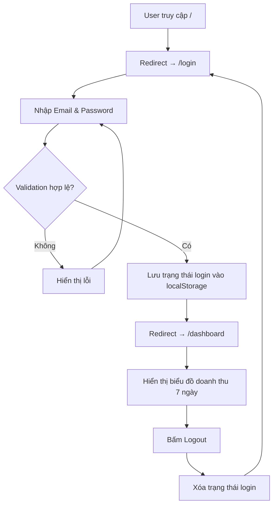

# PRD - Demo Web Application

## 1. Tổng quan

Xây dựng một ứng dụng web sử dụng **Next.js** (React) với giao diện **Dark Mode**. Ứng dụng gồm 2 trang chính: **Login** và **Dashboard**.

---

## 2. Yêu cầu chức năng

### 2.1. Điều hướng (Routing)

| Đường dẫn      | Mô tả                                             |
| --------------- | -------------------------------------------------- |
| `/`             | Tự động redirect sang `/login`                     |
| `/login`        | Trang đăng nhập                                    |
| `/dashboard`    | Trang Dashboard (chỉ truy cập được sau khi login)  |

- Khi user chưa login mà truy cập `/dashboard` → redirect về `/login`.
- Khi user đã login mà truy cập `/login` → redirect sang `/dashboard`.

### 2.2. Trang Login (`/login`)

**Giao diện:**
- Form đăng nhập nằm giữa trang, bao gồm:
  - **Email** — ô nhập liệu (`<input type="email">`).
  - **Password** — ô nhập liệu (`<input type="password">`).
  - **Nút Login** — submit form.

**Validation (client-side):**

| Trường    | Quy tắc                                                       | Thông báo lỗi             |
| --------- | -------------------------------------------------------------- | -------------------------- |
| Email     | Bắt buộc, đúng định dạng email (có `@` và domain)             | "Email không hợp lệ"      |
| Password  | Bắt buộc, tối thiểu 6 ký tự                                   | "Mật khẩu tối thiểu 6 ký tự" |

**Xử lý:**
- Không gọi API, không kiểm tra tài khoản thực.
- Nếu validation hợp lệ → lưu trạng thái đã login (ví dụ: `localStorage`) → redirect sang `/dashboard`.
- Nếu validation thất bại → hiển thị thông báo lỗi dưới ô nhập tương ứng.

### 2.3. Trang Dashboard (`/dashboard`)

**Giao diện:**
- Header hiển thị tiêu đề "Dashboard" và **nút Logout** (phía trên bên phải).
- Nội dung chính: **Biểu đồ doanh thu 7 ngày gần nhất**.

**Biểu đồ doanh thu:**
- Dạng biểu đồ: **Line Chart** hoặc **Bar Chart**.
- Trục X: 7 ngày gần nhất (tính từ ngày hiện tại trở về trước).
- Trục Y: Doanh thu (VNĐ), dữ liệu **giả lập ngẫu nhiên** mỗi lần tải trang.
- Thư viện gợi ý: `recharts` hoặc `chart.js` (react-chartjs-2).

**Nút Logout:**
- Xóa trạng thái login khỏi `localStorage` → redirect về `/login`.

---

## 3. Yêu cầu phi chức năng

| Hạng mục        | Yêu cầu                                                                          |
| ---------------- | --------------------------------------------------------------------------------- |
| Framework        | **Next.js** (App Router) + React                                                 |
| Styling          | **Dark Mode** toàn bộ ứng dụng, giao diện hiện đại, cao cấp                      |
| Authentication   | Client-side only (localStorage), không có backend/API                             |
| Responsive       | Hiển thị tốt trên Desktop và Mobile                                               |
| Typography       | Sử dụng Google Fonts (Inter hoặc tương đương)                                     |
| Hiệu ứng        | Micro-animations cho form, nút bấm và chuyển trang                                |

---

## 4. Sơ đồ luồng hoạt động

---

## 5. Công nghệ & Thư viện dự kiến

| Công nghệ         | Phiên bản / Chi tiết            |
| ------------------ | ------------------------------- |
| Next.js            | Latest (App Router)             |
| React              | 18+                             |
| Recharts           | Thư viện vẽ biểu đồ            |
| CSS                | Vanilla CSS / CSS Modules       |
