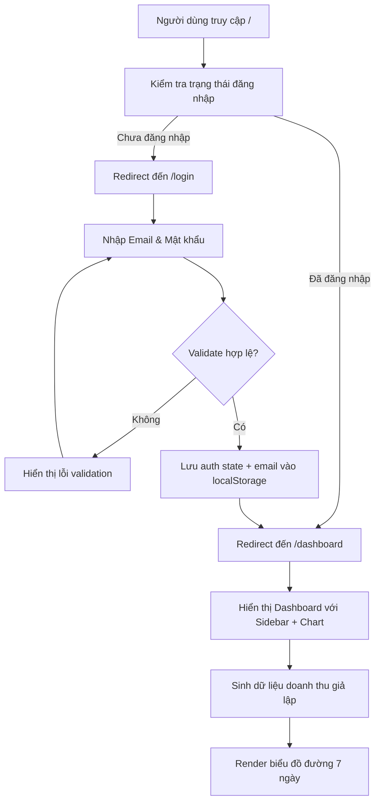

# Product Requirements Document (PRD): Nuxt.js Dashboard Web App

> **Quy ước ID:** Xem chi tiết tại [docs/ID-CONVENTION.md](../ID-CONVENTION.md)

---

## 1. Tổng quan

`prd:nuxt-dashboard-0001`

Xây dựng một ứng dụng web dashboard sử dụng **Nuxt.js (Vue 3)** với **TypeScript**. Ứng dụng gồm 2 trang chính: **Đăng nhập** và **Dashboard**. Mục tiêu là tạo giao diện quản trị với biểu đồ doanh thu giả lập, hệ thống xác thực client-side, và sidebar menu điều hướng.

**Đặc điểm chính:**
- Giao diện **Light Mode** với ngôn ngữ hiển thị **tiếng Việt**.
- Xác thực hoàn toàn ở phía client, lưu trạng thái đăng nhập vào `localStorage`.
- Biểu đồ đường (Line Chart) hiển thị doanh thu 7 ngày với đơn vị **USD**.
- Hiển thị icon user ở góc phải trên cùng, hover hiện email đã đăng nhập.

---

## 2. Yêu cầu chức năng

### 2.1. Điều hướng & Bảo vệ route

`feature:routing-guard-0001`
> Implements: `prd:nuxt-dashboard-0001`

| Đường dẫn | Mô tả | Quyền truy cập |
|------------|--------|-----------------|
| `/` | Trang gốc | Redirect sang `/login` nếu chưa đăng nhập, hoặc `/dashboard` nếu đã đăng nhập |
| `/login` | Trang đăng nhập | Công khai. Nếu đã đăng nhập → redirect sang `/dashboard` |
| `/dashboard` | Trang chính | Yêu cầu đăng nhập. Nếu chưa đăng nhập → redirect sang `/login` |
| `/users` | Quản lý người dùng | Yêu cầu đăng nhập (placeholder, chưa có nội dung) |

**Logic:** Sử dụng Nuxt middleware để kiểm tra trạng thái xác thực từ `localStorage` và tự động redirect.

### 2.2. Trang đăng nhập (`/login`)

`feature:login-page-0002`
> Implements: `prd:nuxt-dashboard-0001`

**Thành phần UI:**
- Form đăng nhập căn giữa màn hình với logo/tiêu đề ứng dụng.
- Ô nhập **Email** (type: email).
- Ô nhập **Mật khẩu** (type: password).
- Nút **Đăng nhập**.

**Logic sau khi đăng nhập thành công:**
- Lưu trạng thái đăng nhập (`isAuthenticated = true`) vào `localStorage`.
- Lưu email người dùng vào `localStorage`.
- Redirect sang `/dashboard`.

### 2.3. Trang Dashboard (`/dashboard`)

`feature:dashboard-page-0003`
> Implements: `prd:nuxt-dashboard-0001`

**Layout:**
- **Sidebar trái:** Menu điều hướng cố định (fixed) với các mục menu.
- **Header trên:** Thanh tiêu đề với icon user ở góc phải.
  - Hover vào icon user → hiển thị tooltip với email đã đăng nhập.
  - Nút đăng xuất.
- **Nội dung chính:** Biểu đồ đường doanh thu 7 ngày.

**Sidebar menu:**

| Mục menu | Đường dẫn | Trạng thái |
|----------|-----------|------------|
| 📊 Dashboard | `/dashboard` | Có nội dung |
| 👥 Quản lý người dùng | `/users` | Placeholder (chưa có nội dung) |

### 2.4. Biểu đồ doanh thu

`feature:revenue-chart-0004`
> Implements: `prd:nuxt-dashboard-0001`

- **Loại biểu đồ:** Line Chart (biểu đồ đường).
- **Dữ liệu:** Giả lập doanh thu 7 ngày gần nhất (random data, sinh khi component mount).
- **Đơn vị tiền tệ:** USD (ví dụ: `$1,250.00`).
- **Trục X:** Ngày (Mon, Tue, Wed, Thu, Fri, Sat, Sun).
- **Trục Y:** Doanh thu (USD).
- **Tương tác:** Tooltip khi hover vào data point hiển thị chi tiết ngày và số tiền.

### 2.5. Thông tin người dùng (User Info)

`feature:user-info-display-0005`
> Implements: `prd:nuxt-dashboard-0001`

- Icon user (avatar mặc định) hiển thị ở góc phải **header**.
- Khi hover/trỏ chuột vào icon → hiển thị **tooltip** chứa email đã đăng nhập.
- Nút **Đăng xuất**: xóa trạng thái đăng nhập khỏi `localStorage` và redirect về `/login`.

---

## 3. Validation / Logic nghiệp vụ

`feature:login-validation-0006`
> Implements: `feature:login-page-0002`

Các quy tắc validation khi bấm nút **Đăng nhập**:

- **Trường Email:**
  - Bắt buộc nhập (báo lỗi: *"Vui lòng nhập email"*).
  - Phải đúng định dạng email (regex) (báo lỗi: *"Email không hợp lệ"*).
- **Trường Mật khẩu:**
  - Bắt buộc nhập (báo lỗi: *"Vui lòng nhập mật khẩu"*).
  - Tối thiểu 6 ký tự (báo lỗi: *"Mật khẩu phải có ít nhất 6 ký tự"*).

> **Lưu ý:** Đây là prototype, không cần xác thực với server. Chỉ cần validate format hợp lệ → cho phép đăng nhập.

---

## 4. Yêu cầu kỹ thuật

`prd:tech-stack-0002`

| Hạng mục | Công nghệ | Ghi chú |
|----------|-----------|---------|
| Framework | **Nuxt.js 3** (Vue 3) | App router, SSR/SPA |
| Ngôn ngữ | **TypeScript** | Strict mode |
| Styling | **Vanilla CSS** | Light mode, thiết kế hiện đại |
| Biểu đồ | **Chart.js** hoặc **vue-chartjs** | Line Chart cho doanh thu |
| Xác thực | `localStorage` | Client-side only (prototype) |
| Responsive | Mobile-first | Breakpoints: 768px / 1024px |

**Ngôn ngữ giao diện:** Tiếng Việt.

---

## 5. Luồng hoạt động

---

## 6. Các bước triển khai

| # | ID | Implements | Bước | Trạng thái |
|---|----|------------|------|------------|
| 1 | `task:setup-nuxtjs-0001` | `prd:tech-stack-0002` | Khởi tạo dự án Nuxt.js 3 với TypeScript | ⬜ Chưa làm |
| 2 | `task:setup-light-theme-0002` | `prd:tech-stack-0002` | Thiết lập Light Theme & Design System (CSS variables, typography, colors) | ⬜ Chưa làm |
| 3 | `task:implement-auth-middleware-0003` | `feature:routing-guard-0001` | Tạo middleware xác thực & cấu hình routing | ⬜ Chưa làm |
| 4 | `task:build-login-page-0004` | `feature:login-page-0002` | Xây dựng trang Login với form & validation | ⬜ Chưa làm |
| 5 | `task:build-dashboard-layout-0005` | `feature:dashboard-page-0003` | Xây dựng layout Dashboard (sidebar + header + content) | ⬜ Chưa làm |
| 6 | `task:add-revenue-chart-0006` | `feature:revenue-chart-0004` | Tích hợp biểu đồ doanh thu 7 ngày (Chart.js) | ⬜ Chưa làm |
| 7 | `task:add-user-info-header-0007` | `feature:user-info-display-0005` | Thêm icon user + tooltip email + nút đăng xuất | ⬜ Chưa làm |
| 8 | `task:add-placeholder-pages-0008` | `feature:dashboard-page-0003` | Tạo các trang placeholder (Quản lý người dùng) | ⬜ Chưa làm |

---

## Phụ lục: Bảng tổng hợp ID & Truy vết

| ID | Loại | Implements | Mô tả ngắn |
|----|------|------------|-------------|
| [`prd:nuxt-dashboard-0001`](#1-tổng-quan) | prd | — (gốc) | Yêu cầu tổng quan ứng dụng dashboard |
| [`prd:tech-stack-0002`](#4-yêu-cầu-kỹ-thuật) | prd | — (gốc) | Yêu cầu về công nghệ & kỹ thuật |
| [`feature:routing-guard-0001`](#21-điều-hướng--bảo-vệ-route) | feature | [`prd:nuxt-dashboard-0001`](#1-tổng-quan) | Hệ thống điều hướng & bảo vệ route |
| [`feature:login-page-0002`](#22-trang-đăng-nhập-login) | feature | [`prd:nuxt-dashboard-0001`](#1-tổng-quan) | Giao diện trang đăng nhập |
| [`feature:dashboard-page-0003`](#23-trang-dashboard-dashboard) | feature | [`prd:nuxt-dashboard-0001`](#1-tổng-quan) | Giao diện trang dashboard |
| [`feature:revenue-chart-0004`](#24-biểu-đồ-doanh-thu) | feature | [`prd:nuxt-dashboard-0001`](#1-tổng-quan) | Biểu đồ doanh thu 7 ngày |
| [`feature:user-info-display-0005`](#25-thông-tin-người-dùng-user-info) | feature | [`prd:nuxt-dashboard-0001`](#1-tổng-quan) | Hiển thị thông tin user & đăng xuất |
| [`feature:login-validation-0006`](#3-validation--logic-nghiệp-vụ) | feature | [`feature:login-page-0002`](#22-trang-đăng-nhập-login) | Validation form đăng nhập |
| [`task:setup-nuxtjs-0001`](#6-các-bước-triển-khai) | task | [`prd:tech-stack-0002`](#4-yêu-cầu-kỹ-thuật) | Khởi tạo dự án Nuxt.js |
| [`task:setup-light-theme-0002`](#6-các-bước-triển-khai) | task | [`prd:tech-stack-0002`](#4-yêu-cầu-kỹ-thuật) | Thiết lập Light Theme |
| [`task:implement-auth-middleware-0003`](#6-các-bước-triển-khai) | task | [`feature:routing-guard-0001`](#21-điều-hướng--bảo-vệ-route) | Middleware xác thực |
| [`task:build-login-page-0004`](#6-các-bước-triển-khai) | task | [`feature:login-page-0002`](#22-trang-đăng-nhập-login) | Xây dựng trang Login |
| [`task:build-dashboard-layout-0005`](#6-các-bước-triển-khai) | task | [`feature:dashboard-page-0003`](#23-trang-dashboard-dashboard) | Layout Dashboard |
| [`task:add-revenue-chart-0006`](#6-các-bước-triển-khai) | task | [`feature:revenue-chart-0004`](#24-biểu-đồ-doanh-thu) | Biểu đồ doanh thu |
| [`task:add-user-info-header-0007`](#6-các-bước-triển-khai) | task | [`feature:user-info-display-0005`](#25-thông-tin-người-dùng-user-info) | Icon user & đăng xuất |
| [`task:add-placeholder-pages-0008`](#6-các-bước-triển-khai) | task | [`feature:dashboard-page-0003`](#23-trang-dashboard-dashboard) | Trang placeholder |
