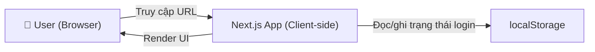
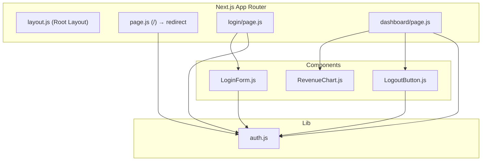
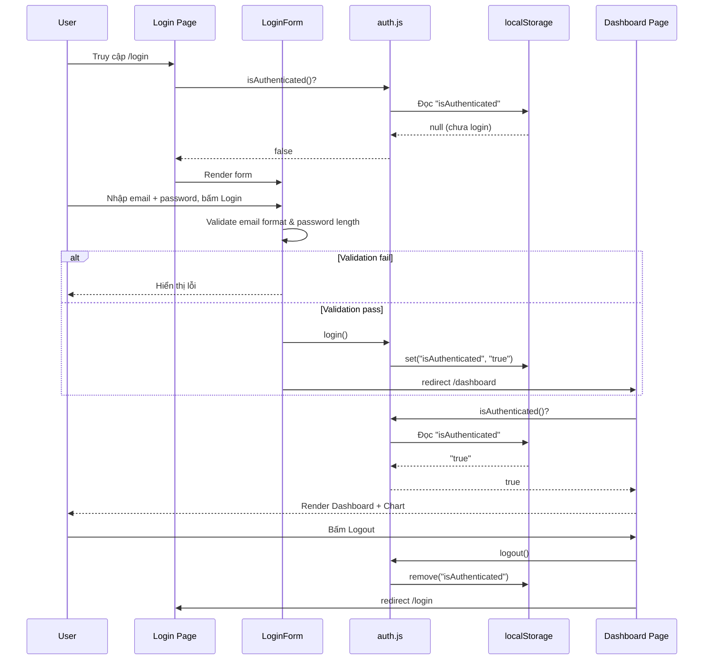

# System Design Document
`research:arch-design-0001`
> Implements: `prd:tech-stack-0003`

---

## 1. Tổng quan kiến trúc

Ứng dụng là một **Single Page Application (SPA)** xây dựng bằng Next.js App Router. Kiến trúc đơn giản, không có backend — toàn bộ logic xử lý ở client-side.



---

## 2. Module/Component Design

### 2.1 Cấu trúc thư mục source code

```
src/
├── app/                       # Next.js App Router
│   ├── layout.js              # Root Layout (font, global styles)
│   ├── page.js                # Route "/" → redirect /login
│   ├── login/
│   │   └── page.js            # Trang Login
│   └── dashboard/
│       └── page.js            # Trang Dashboard
├── components/                # Shared UI Components
│   ├── LoginForm.js           # Form đăng nhập + validation
│   ├── RevenueChart.js        # Biểu đồ doanh thu
│   └── LogoutButton.js        # Nút Logout
├── lib/                       # Utility / Logic
│   └── auth.js                # Auth helpers (login, logout, isAuthenticated)
└── styles/                    # CSS
    └── globals.css            # Design system, Dark Mode tokens
```

### 2.2 Component Diagram



### 2.3 Interface/Contract

| Module/Component | Public API | Dependencies |
|------------------|-----------|--------------|
| `auth.js` | `login()`, `logout()`, `isAuthenticated()` | localStorage |
| `LoginForm.js` | Props: none. Handles form state, validation, submit | `auth.js`, `next/navigation` |
| `RevenueChart.js` | Props: none. Generates random data on mount | `recharts` |
| `LogoutButton.js` | Props: none. Calls logout() on click | `auth.js`, `next/navigation` |

---

## 3. Data Flow



**State management:** Sử dụng React `useState` cho form state (email, password, errors). Trạng thái login lưu trong `localStorage` — không dùng Context hay state management library vì phạm vi nhỏ.

---

## 4. Quy ước kỹ thuật

- **Coding Standards:**
  - File/component naming: PascalCase cho components (`LoginForm.js`), camelCase cho utilities (`auth.js`)
  - Sử dụng ES modules (`import/export`)
  - Tất cả page components đều là `"use client"` (vì dùng localStorage, useState)
- **Error Handling:**
  - Validation errors hiển thị inline dưới input tương ứng
  - Không dùng alert/modal cho error messages
- **Responsive Strategy:**
  - Mobile-first approach
  - Breakpoints: `768px` (tablet), `1024px` (desktop)
  - Login form max-width: 400px, centered
  - Chart sử dụng `ResponsiveContainer` của Recharts

---

## 5. Rủi ro kỹ thuật

| # | Rủi ro | Impact | Likelihood | Mitigation |
|---|--------|--------|------------|------------|
| 1 | localStorage không khả dụng (incognito/disabled) | Medium | Low | Fallback: coi như chưa login |
| 2 | Recharts SSR incompatibility | Medium | Medium | Dùng `"use client"` directive và dynamic import nếu cần |
| 3 | Random data tạo ra giá trị âm hoặc quá lớn | Low | Low | Giới hạn range: 1,000,000 – 50,000,000 VNĐ |

---

## 6. Danh mục Technology Stack

| Layer | Technology | Version | Lý do chọn |
|-------|------------|---------|------------|
| Language | JavaScript (ES6+) | — | Phổ biến, ecosystem lớn |
| Framework | Next.js (App Router) | Latest | File-based routing, React Server Components |
| UI Library | React | 18+ | Component-based, hooks API |
| Charting | Recharts | Latest | Declarative, React-native, responsive |
| Styling | CSS Modules / Vanilla CSS | — | Tối ưu performance, không cần thư viện CSS bên ngoài |
| Font | Inter (Google Fonts) | — | Typography hiện đại, dễ đọc |
